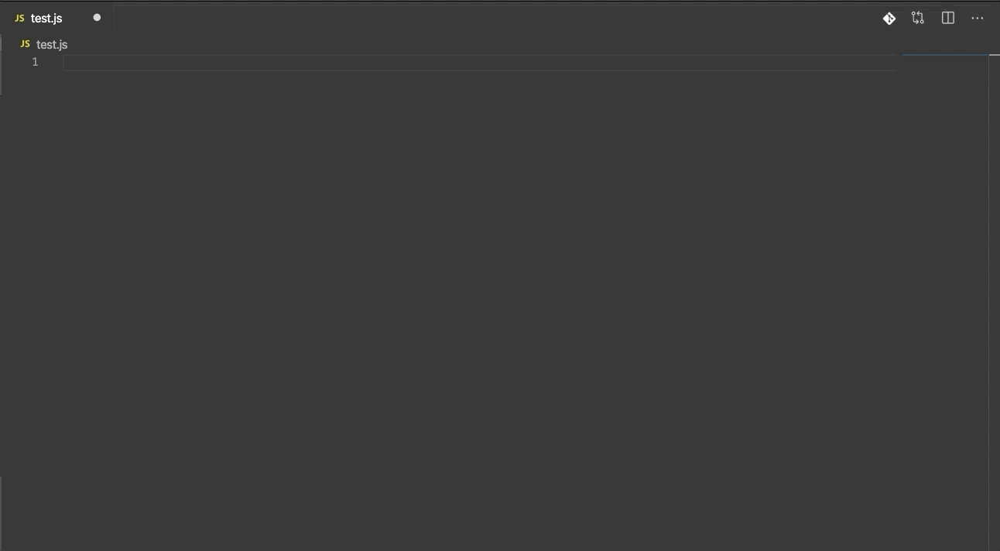

# SFE 

## VS Code SFE snippets

---
这个vscode拓展包含[SFE][sfe]组件库代码段,为了方便快速开发业务。

## 安装
搜索sfe-vscode-plugin进行安装

## 支持的文件类型

- JavaScript (.js)
- TypeScript (.ts)
- JavaScript React (.jsx)
- TypeScript React (.tsx)

## 用法
输入前缀触发代码段

## Snippets

下面是代码段的触发方式， **⇥** 代表tab键

|  Trigger | Content                                                          |
| -------: | ---------------------------------------------------------------- |
|   `sfeig→` | sfe-item-generator                                        |
|   `sfedh→` | sfe-danger-html               |
|  `sfeac→` | sfe-async-component |
|  `sfeim→` | sfe-input-maxlength        |
|  `sfect→` |sfe-count-time |

[sfe]: http://sfe.intra.xiaojukeji.com/
[babelsublime]: https://github.com/babel/babel-sublime-snippets